# Diagramas de Pakopi (ERS versión 2.0)

Código fuente en Mermaid (`.mmd`), editable con cualquier editor de texto. Imágenes en `svg/` y `png/`. Las figuras 1 a 19 están insertadas en `Pakopi_ERS_V2.docx`. Los elementos con RF-90 a RF-100 son requisitos agregados tras la reunión con usuarios del 4 de noviembre de 2026, previstos y aún no implementados.

## Cómo regenerar una imagen

Los diagramas de clases (`10*`) usan `mermaid-config-clases.json`; los casos de uso `02a` y `02b` usan `mermaid-config-casos.json`; el resto usa `mermaid-config.json`. Si un título lleva dos puntos, va entre comillas.

```bash
npx -p @mermaid-js/mermaid-cli mmdc -i 03_estados_jornada.mmd -o png/03_estados_jornada.png -c mermaid-config.json -b white -s 3
```

También se pueden editar en línea en https://mermaid.live. Después de cambiar una imagen, reemplázala en el Word (clic derecho → Cambiar imagen).

| Archivo | Contenido |
|---|---|
| [01_contexto_despliegue.mmd](01_contexto_despliegue.mmd) | Figura 1 · Contexto y despliegue (2.1). |
| [02a_casos_de_uso_administrador.mmd](02a_casos_de_uso_administrador.mmd) | Figura 2 · Casos de uso del administrador, incluidos precios, inventario, cuadre, sedes, vales y resumen por periodo (2.2). |
| [02b_casos_de_uso_operario.mmd](02b_casos_de_uso_operario.mmd) | Figura 3 · Casos de uso del operario, incluidos precio base, pagos, registro rápido de externos, venta rápida, vales y copia externa (2.2). |
| [02c_casos_de_uso_productor.mmd](02c_casos_de_uso_productor.mmd) | Figura 4 · Casos de uso del productor y representante (2.2). |
| [08_secuencia_recuperacion_acceso.mmd](08_secuencia_recuperacion_acceso.mmd) | Figura 5 · Recuperación presencial de acceso (3.2.1). |
| [09a_secuencia_aprobacion_y_pago.mmd](09a_secuencia_aprobacion_y_pago.mmd) | Figura 6 · Aprobación de liquidación y pago por admin u operario, con conexión (3.2.3). |
| [09c_secuencia_pago_en_campo_y_duplicado.mmd](09c_secuencia_pago_en_campo_y_duplicado.mmd) | Figura 7 · Prevención de pago duplicado (3.2.3). |
| [09b_secuencia_consulta_y_anulacion_pago.mmd](09b_secuencia_consulta_y_anulacion_pago.mmd) | Figura 8 · Consulta del productor y anulación de pago (3.2.3). |
| [05_estados_sincronizacion.mmd](05_estados_sincronizacion.mmd) | Figura 9 · Estados de una operación en el dispositivo (3.2.8). |
| [07a_secuencia_registro_y_sincronizacion.mmd](07a_secuencia_registro_y_sincronizacion.mmd) | Figura 10 · Registro offline y sincronización (3.2.8). |
| [07b_secuencia_reintento_y_catalogo.mmd](07b_secuencia_reintento_y_catalogo.mmd) | Figura 11 · Reintento por timeout y descarga de catálogo (3.2.8). |
| [10a_clases_jornadas_compras.mmd](10a_clases_jornadas_compras.mmd) | Figura 12 · Clases: jornadas y compras (3.5). |
| [10b_clases_liquidacion_pagos.mmd](10b_clases_liquidacion_pagos.mmd) | Figura 13 · Clases: liquidación y pagos (3.5). |
| [10c_clases_usuarios_familias.mmd](10c_clases_usuarios_familias.mmd) | Figura 14 · Clases: usuarios, roles y familias (3.5). |
| [10d_clases_ventas_sync_auditoria.mmd](10d_clases_ventas_sync_auditoria.mmd) | Vista de clases: ventas, inventario, cuadre, sedes, vales, sincronización y auditoría (no está en el Word: la figura 15 es el modelo entidad-relación del esquema real). |
| [03_estados_jornada.mmd](03_estados_jornada.mmd) | Figura 16 · Estados de la jornada (5.5). |
| [04_estados_compra_y_pago.mmd](04_estados_compra_y_pago.mmd) | Figura 17 · Estados de la compra y del pago (5.5). |
| [06a_actividad_ejecucion_jornada.mmd](06a_actividad_ejecucion_jornada.mmd) | Figura 18 · Actividades de ejecución y cierre (5.5). |
| [06b_actividad_aprobacion_pago.mmd](06b_actividad_aprobacion_pago.mmd) | Figura 19 · Actividades de aprobación y pago (5.5). |
| [06_actividad_ciclo_jornada.mmd](06_actividad_ciclo_jornada.mmd) | Vista completa de actividades (no está en el Word; desactualizada en pagos, ver figuras 18 y 19). |
| [10_clases_modelo_datos.mmd](10_clases_modelo_datos.mmd) | Vista completa del modelo de clases (no está en el Word, se dividió en las figuras 12 a 15). |


## 01_contexto_despliegue

Figura 1 · Contexto y despliegue (2.1).

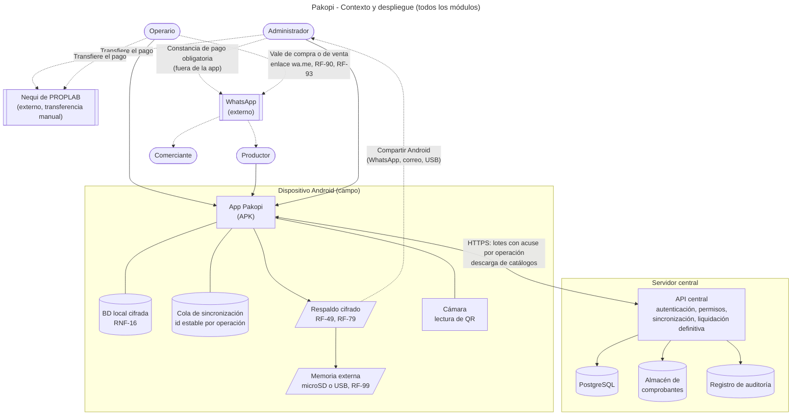
```mermaid
---
title: "Pakopi - Contexto y despliegue (todos los módulos)"
---
flowchart TB
    ADM(["Administrador"])
    OPE(["Operario"])
    PRO(["Productor"])
    COM(["Comerciante"])
    NEQ[["Nequi de PROPLAB<br/>(externo, transferencia manual)"]]
    WA[["WhatsApp<br/>(externo)"]]

    subgraph CEL["Dispositivo Android (campo)"]
        direction TB
        APP["App Pakopi<br/>(APK)"]
        BDL[("BD local cifrada<br/>RNF-16")]
        COLA[("Cola de sincronización<br/>id estable por operación")]
        RESP[/"Respaldo cifrado<br/>RF-49, RF-79"/]
        CAM["Cámara<br/>lectura de QR"]
        MEM[/"Memoria externa<br/>microSD o USB, RF-99"/]
        APP --- BDL
        APP --- COLA
        APP --- CAM
        APP --> RESP
        RESP --> MEM
    end

    subgraph SRV["Servidor central"]
        direction TB
        API["API central<br/>autenticación, permisos,<br/>sincronización, liquidación definitiva"]
        PG[("PostgreSQL")]
        ARCH[("Almacén de<br/>comprobantes")]
        AUD[("Registro de auditoría")]
        API --> PG
        API --> ARCH
        API --> AUD
    end

    OPE --> APP
    PRO --> APP
    ADM --> APP
    APP <-->|"HTTPS: lotes con acuse por operación<br/>descarga de catálogos"| API
    RESP -.->|"Compartir Android<br/>(WhatsApp, correo, USB)"| ADM
    ADM -.->|"Transfiere el pago"| NEQ
    OPE -.->|"Transfiere el pago"| NEQ
    ADM -.->|"Constancia de pago obligatoria<br/>(fuera de la app)"| WA
    OPE -.->|"Vale de compra o de venta<br/>enlace wa.me, RF-90, RF-93"| WA
    WA -.-> PRO
    WA -.-> COM
```

## 02a_casos_de_uso_administrador

Figura 2 · Casos de uso del administrador (2.2).

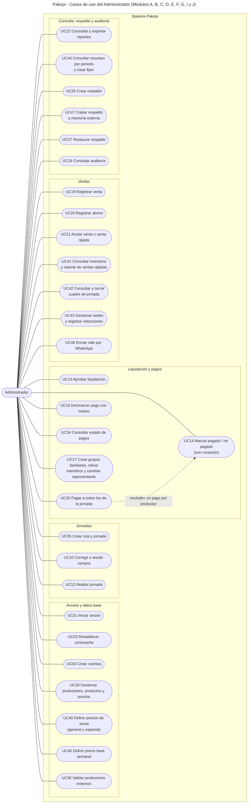
```mermaid
---
title: "Pakopi - Casos de uso del Administrador (Módulos A, B, C, D, E, F, G, I y J)"
---
flowchart LR
    ADM(["Administrador"])

    subgraph SIS["Sistema Pakopi"]
        direction TB
        subgraph A["Acceso y datos base"]
            UC01(["UC01 Iniciar sesión"])
            UC03(["UC03 Restablecer contraseña"])
            UC04(["UC04 Crear cuentas"])
            UC28(["UC28 Gestionar productores, productos y precios"])
            UC40(["UC40 Definir precios de venta<br/>(general y especial)"])
            UC45(["UC45 Definir precio base semanal"])
            UC36(["UC36 Validar productores externos"])
        end
        subgraph J["Jornadas"]
            UC05(["UC05 Crear ruta y jornada"])
            UC10(["UC10 Corregir o anular compra"])
            UC12(["UC12 Reabrir jornada"])
        end
        subgraph C["Liquidación y pagos"]
            UC13(["UC13 Aprobar liquidación"])
            UC14(["UC14 Marcar pagado / no pagado<br/>(con conexión)"])
            UC35(["UC35 Pagar a todos los de la jornada"])
            UC16(["UC16 Desmarcar pago con motivo"])
            UC34(["UC34 Consultar estado de pagos"])
            UC17(["UC17 Crear grupos familiares, retirar<br/>miembros y cambiar representante"])
        end
        subgraph V["Ventas"]
            UC19(["UC19 Registrar venta"])
            UC20(["UC20 Registrar abono"])
            UC21(["UC21 Anular venta o venta rápida"])
            UC41(["UC41 Consultar inventario<br/>y reporte de ventas rápidas"])
            UC42(["UC42 Consultar y cerrar<br/>cuadre de jornada"])
            UC43(["UC43 Gestionar sedes<br/>y registrar retenciones"])
            UC46(["UC46 Enviar vale por WhatsApp"])
        end
        subgraph G["Consulta, respaldo y auditoría"]
            UC22(["UC22 Consultar y exportar reportes"])
            UC44(["UC44 Consultar resumen por periodo<br/>y crear flyer"])
            UC26(["UC26 Crear respaldo"])
            UC47(["UC47 Copiar respaldo<br/>a memoria externa"])
            UC27(["UC27 Restaurar respaldo"])
            UC29(["UC29 Consultar auditoría"])
        end
    end

    ADM --- UC01 & UC03 & UC04 & UC28 & UC40 & UC45 & UC36
    ADM --- UC05 & UC10 & UC12
    ADM --- UC13 & UC14 & UC35 & UC16 & UC34 & UC17
    ADM --- UC19 & UC20 & UC21 & UC41 & UC42 & UC43 & UC46
    ADM --- UC22 & UC44 & UC26 & UC47 & UC27 & UC29

    UC35 -.->|"«include» un pago por productor"| UC14
```

## 02b_casos_de_uso_operario

Figura 3 · Casos de uso del operario, incluidos pagos y registro rápido de externos (2.2).

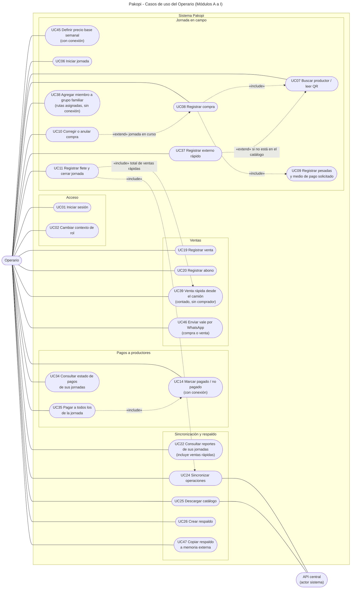
```mermaid
---
title: "Pakopi - Casos de uso del Operario (Módulos A a I)"
---
flowchart LR
    OPE(["Operario"])
    API(["API central<br/>(actor sistema)"])

    subgraph SIS["Sistema Pakopi"]
        direction TB
        subgraph A["Acceso"]
            UC01(["UC01 Iniciar sesión"])
            UC02(["UC02 Cambiar contexto de rol"])
        end
        subgraph J["Jornada en campo"]
            UC45(["UC45 Definir precio base semanal<br/>(con conexión)"])
            UC06(["UC06 Iniciar jornada"])
            UC07(["UC07 Buscar productor / leer QR"])
            UC08(["UC08 Registrar compra"])
            UC09(["UC09 Registrar pesadas<br/>y medio de pago solicitado"])
            UC37(["UC37 Registrar externo rápido"])
            UC10(["UC10 Corregir o anular compra"])
            UC11(["UC11 Registrar flete y cerrar jornada"])
            UC38(["UC38 Agregar miembro a grupo familiar<br/>(rutas asignadas, sin conexión)"])
        end
        subgraph P["Pagos a productores"]
            UC14(["UC14 Marcar pagado / no pagado<br/>(con conexión)"])
            UC35(["UC35 Pagar a todos los<br/>de la jornada"])
            UC34(["UC34 Consultar estado de pagos<br/>de sus jornadas"])
        end
        subgraph V["Ventas"]
            UC19(["UC19 Registrar venta"])
            UC20(["UC20 Registrar abono"])
            UC39(["UC39 Venta rápida desde el camión<br/>(contado, sin comprador)"])
            UC46(["UC46 Enviar vale por WhatsApp<br/>(compra o venta)"])
        end
        subgraph S["Sincronización y respaldo"]
            UC22(["UC22 Consultar reportes de sus jornadas<br/>(incluye ventas rápidas)"])
            UC24(["UC24 Sincronizar operaciones"])
            UC25(["UC25 Descargar catálogo"])
            UC26(["UC26 Crear respaldo"])
            UC47(["UC47 Copiar respaldo<br/>a memoria externa"])
        end
    end

    OPE --- UC01 & UC02
    OPE --- UC45 & UC06 & UC07 & UC08 & UC37 & UC10 & UC11 & UC38
    OPE --- UC14 & UC35 & UC34
    OPE --- UC19 & UC20 & UC39 & UC46
    OPE --- UC22 & UC24 & UC25 & UC26 & UC47
    UC24 --- API
    UC25 --- API

    UC08 -.->|"«include»"| UC09
    UC08 -.->|"«include»"| UC07
    UC10 -.->|"«extend» jornada en curso"| UC08
    UC11 -.->|"«include»"| UC24
    UC37 -.->|"«extend» si no está en el catálogo"| UC07
    UC35 -.->|"«include»"| UC14
    UC11 -.->|"«include» total de ventas rápidas"| UC39
```

## 02c_casos_de_uso_productor

Figura 4 · Casos de uso del productor y representante (2.2).

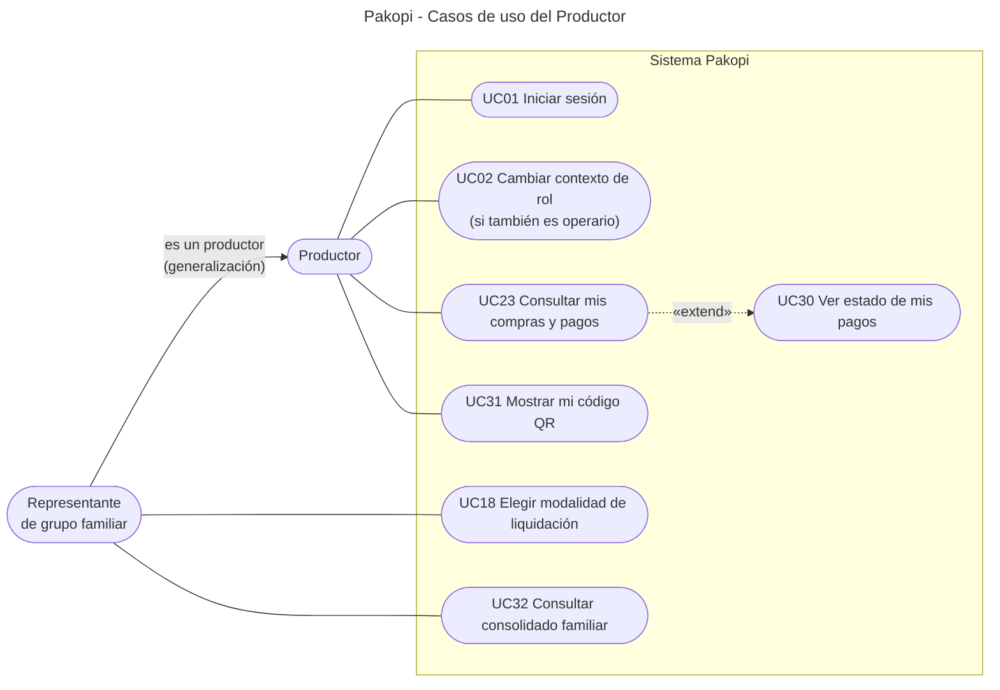
```mermaid
---
title: Pakopi - Casos de uso del Productor
---
flowchart LR
    PRO(["Productor"])
    REP(["Representante<br/>de grupo familiar"])

    subgraph SIS["Sistema Pakopi"]
        direction TB
        UC01(["UC01 Iniciar sesión"])
        UC02(["UC02 Cambiar contexto de rol<br/>(si también es operario)"])
        UC23(["UC23 Consultar mis compras y pagos"])
        UC30(["UC30 Ver estado de mis pagos"])
        UC31(["UC31 Mostrar mi código QR"])
        UC18(["UC18 Elegir modalidad de liquidación"])
        UC32(["UC32 Consultar consolidado familiar"])
    end

    PRO --- UC01 & UC02 & UC23 & UC31
    REP --- UC18 & UC32
    REP -->|"es un productor<br/>(generalización)"| PRO
    UC23 -.->|"«extend»"| UC30
```

## 08_secuencia_recuperacion_acceso

Figura 5 · Recuperación presencial de acceso (3.2.1).

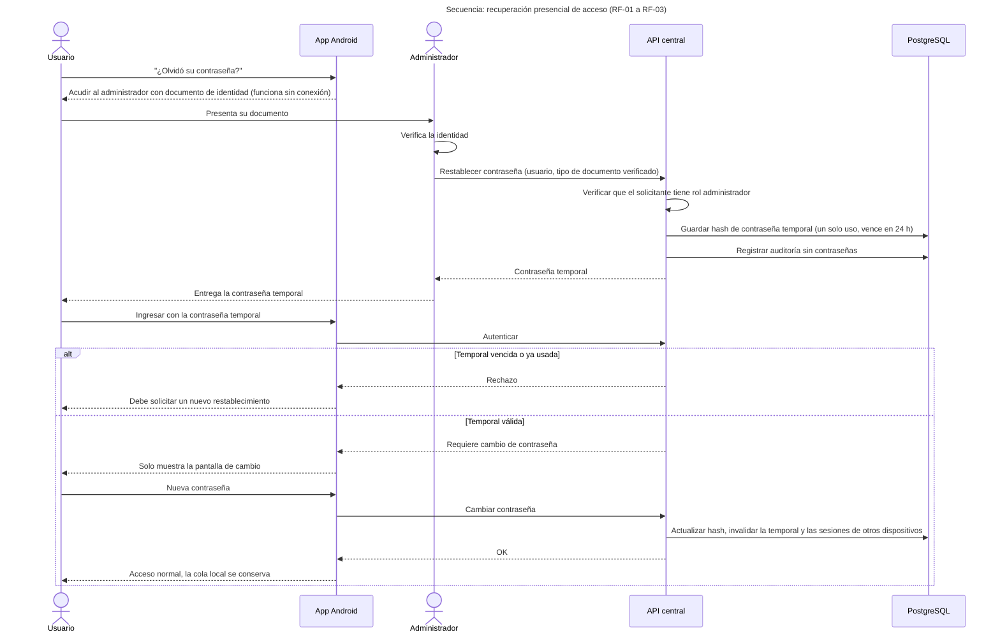
```mermaid
---
title: "Secuencia: recuperación presencial de acceso (RF-01 a RF-03)"
---
sequenceDiagram
    actor U as Usuario
    participant APP as App Android
    actor A as Administrador
    participant API as API central
    participant BD as PostgreSQL

    U->>APP: "¿Olvidó su contraseña?"
    APP-->>U: Acudir al administrador con documento de identidad (funciona sin conexión)
    U->>A: Presenta su documento
    A->>A: Verifica la identidad
    A->>API: Restablecer contraseña (usuario, tipo de documento verificado)
    API->>API: Verificar que el solicitante tiene rol administrador
    API->>BD: Guardar hash de contraseña temporal (un solo uso, vence en 24 h)
    API->>BD: Registrar auditoría sin contraseñas
    API-->>A: Contraseña temporal
    A-->>U: Entrega la contraseña temporal

    U->>APP: Ingresar con la contraseña temporal
    APP->>API: Autenticar
    alt Temporal vencida o ya usada
        API-->>APP: Rechazo
        APP-->>U: Debe solicitar un nuevo restablecimiento
    else Temporal válida
        API-->>APP: Requiere cambio de contraseña
        APP-->>U: Solo muestra la pantalla de cambio
        U->>APP: Nueva contraseña
        APP->>API: Cambiar contraseña
        API->>BD: Actualizar hash, invalidar la temporal y las sesiones de otros dispositivos
        API-->>APP: OK
        APP-->>U: Acceso normal, la cola local se conserva
    end
```

## 09a_secuencia_aprobacion_y_pago

Figura 6 · Aprobación de liquidación y pago por admin u operario, con conexión (3.2.3).

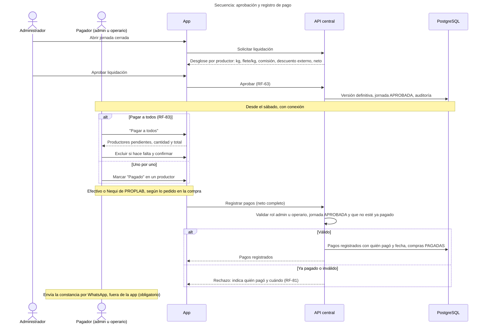
```mermaid
---
title: "Secuencia: aprobación y registro de pago"
---
sequenceDiagram
    actor A as Administrador
    actor PG as Pagador (admin u operario)
    participant APP as App
    participant API as API central
    participant BD as PostgreSQL

    A->>APP: Abrir jornada cerrada
    APP->>API: Solicitar liquidación
    API-->>APP: Desglose por productor: kg, flete/kg, comisión, descuento externo, neto
    A->>APP: Aprobar liquidación
    APP->>API: Aprobar (RF-63)
    API->>BD: Versión definitiva, jornada APROBADA, auditoría

    Note over PG,BD: Desde el sábado, con conexión
    alt Pagar a todos (RF-83)
        PG->>APP: "Pagar a todos"
        APP-->>PG: Productores pendientes, cantidad y total
        PG->>APP: Excluir si hace falta y confirmar
    else Uno por uno
        PG->>APP: Marcar "Pagado" en un productor
    end
    Note over PG,APP: Efectivo o Nequi de PROPLAB, según lo pedido en la compra
    APP->>API: Registrar pagos (neto completo)
    API->>API: Validar rol admin u operario, jornada APROBADA y que no esté ya pagado
    alt Válido
        API->>BD: Pagos registrados con quién pagó y fecha, compras PAGADAS
        API-->>APP: Pagos registrados
    else Ya pagado o inválido
        API-->>APP: Rechazo: indica quién pagó y cuándo (RF-81)
    end
    Note over PG: Envía la constancia por WhatsApp, fuera de la app (obligatorio)
```

## 09c_secuencia_pago_en_campo_y_duplicado

Figura 7 · Prevención de pago duplicado (3.2.3).

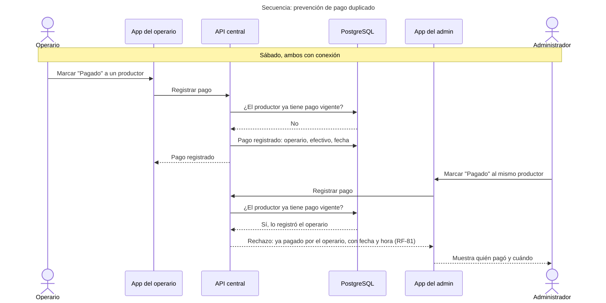
```mermaid
---
title: "Secuencia: prevención de pago duplicado"
---
sequenceDiagram
    actor O as Operario
    participant AO as App del operario
    participant API as API central
    participant BD as PostgreSQL
    participant AA as App del admin
    actor A as Administrador

    Note over O,A: Sábado, ambos con conexión
    O->>AO: Marcar "Pagado" a un productor
    AO->>API: Registrar pago
    API->>BD: ¿El productor ya tiene pago vigente?
    BD-->>API: No
    API->>BD: Pago registrado: operario, efectivo, fecha
    API-->>AO: Pago registrado

    A->>AA: Marcar "Pagado" al mismo productor
    AA->>API: Registrar pago
    API->>BD: ¿El productor ya tiene pago vigente?
    BD-->>API: Sí, lo registró el operario
    API-->>AA: Rechazo: ya pagado por el operario, con fecha y hora (RF-81)
    AA-->>A: Muestra quién pagó y cuándo
```

## 09b_secuencia_consulta_y_anulacion_pago

Figura 8 · Consulta del productor y anulación de pago (3.2.3).

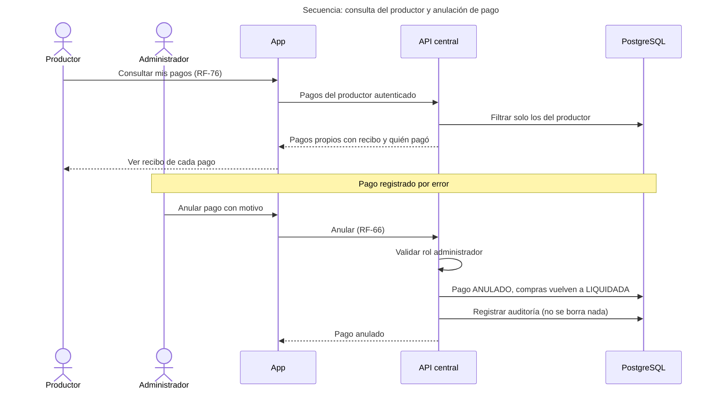
```mermaid
---
title: "Secuencia: consulta del productor y anulación de pago"
---
sequenceDiagram
    actor P as Productor
    actor A as Administrador
    participant APP as App
    participant API as API central
    participant BD as PostgreSQL

    P->>APP: Consultar mis pagos (RF-76)
    APP->>API: Pagos del productor autenticado
    API->>BD: Filtrar solo los del productor
    API-->>APP: Pagos propios con recibo y quién pagó
    APP-->>P: Ver recibo de cada pago

    Note over A,BD: Pago registrado por error
    A->>APP: Anular pago con motivo
    APP->>API: Anular (RF-66)
    API->>API: Validar rol administrador
    API->>BD: Pago ANULADO, compras vuelven a LIQUIDADA
    API->>BD: Registrar auditoría (no se borra nada)
    API-->>APP: Pago anulado
```

## 05_estados_sincronizacion

Figura 9 · Estados de una operación en el dispositivo (3.2.8).

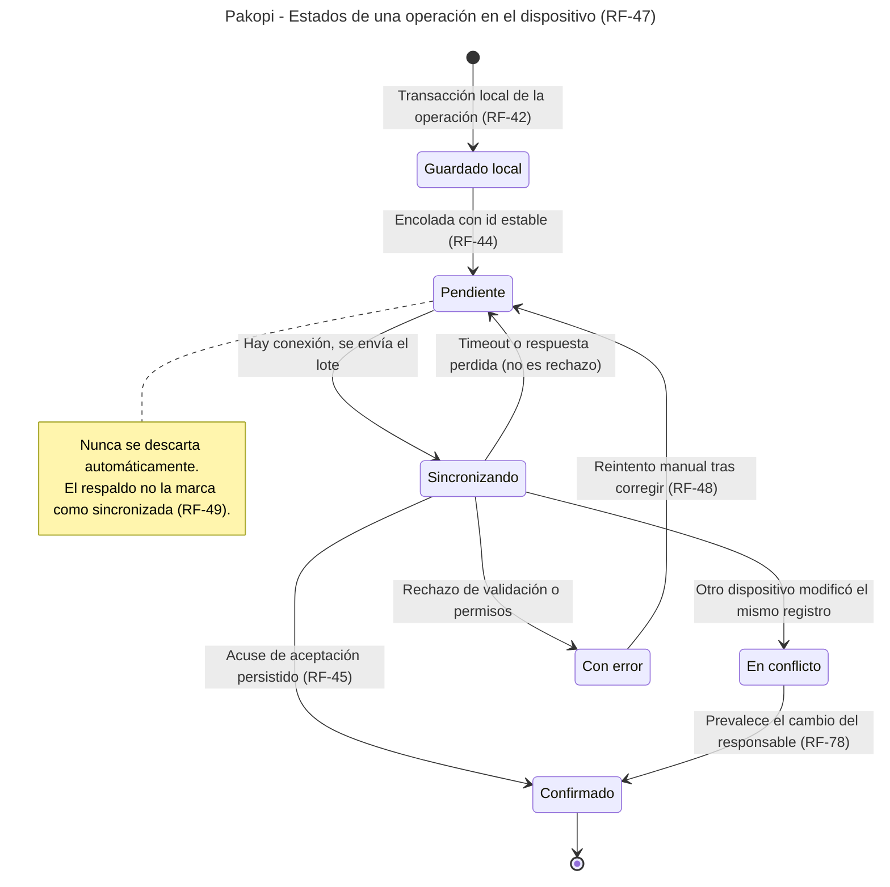
```mermaid
---
title: Pakopi - Estados de una operación en el dispositivo (RF-47)
---
stateDiagram-v2
    direction TB
    state "Guardado local" as Local
    state "Pendiente" as Pendiente
    state "Sincronizando" as Sincronizando
    state "Confirmado" as Confirmado
    state "En conflicto" as Conflicto
    state "Con error" as Error

    [*] --> Local : Transacción local de la operación (RF-42)
    Local --> Pendiente : Encolada con id estable (RF-44)
    Pendiente --> Sincronizando : Hay conexión, se envía el lote
    Sincronizando --> Confirmado : Acuse de aceptación persistido (RF-45)
    Sincronizando --> Pendiente : Timeout o respuesta perdida (no es rechazo)
    Sincronizando --> Conflicto : Otro dispositivo modificó el mismo registro
    Sincronizando --> Error : Rechazo de validación o permisos
    Conflicto --> Confirmado : Prevalece el cambio del responsable (RF-78)
    Error --> Pendiente : Reintento manual tras corregir (RF-48)
    Confirmado --> [*]

    note right of Pendiente
        Nunca se descarta automáticamente.
        El respaldo no la marca como sincronizada (RF-49).
    end note
```

## 07a_secuencia_registro_y_sincronizacion

Figura 10 · Registro offline y sincronización (3.2.8).

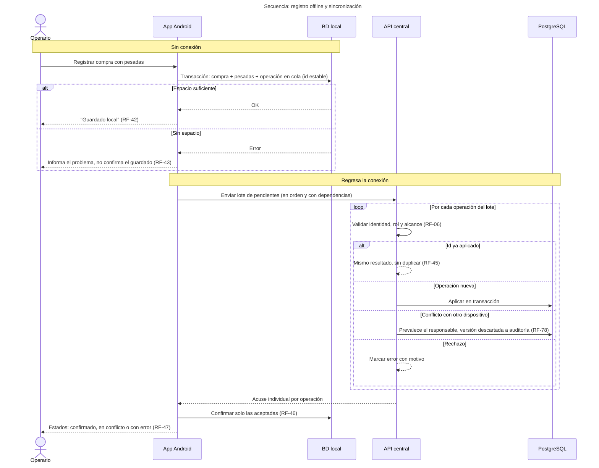
```mermaid
---
title: "Secuencia: registro offline y sincronización"
---
sequenceDiagram
    actor O as Operario
    participant APP as App Android
    participant BDL as BD local
    participant API as API central
    participant PG as PostgreSQL

    Note over O,BDL: Sin conexión
    O->>APP: Registrar compra con pesadas
    APP->>BDL: Transacción: compra + pesadas + operación en cola (id estable)
    alt Espacio suficiente
        BDL-->>APP: OK
        APP-->>O: "Guardado local" (RF-42)
    else Sin espacio
        BDL-->>APP: Error
        APP-->>O: Informa el problema, no confirma el guardado (RF-43)
    end

    Note over APP,PG: Regresa la conexión
    APP->>API: Enviar lote de pendientes (en orden y con dependencias)
    loop Por cada operación del lote
        API->>API: Validar identidad, rol y alcance (RF-06)
        alt Id ya aplicado
            API-->>API: Mismo resultado, sin duplicar (RF-45)
        else Operación nueva
            API->>PG: Aplicar en transacción
        else Conflicto con otro dispositivo
            API->>PG: Prevalece el responsable, versión descartada a auditoría (RF-78)
        else Rechazo
            API-->>API: Marcar error con motivo
        end
    end
    API-->>APP: Acuse individual por operación
    APP->>BDL: Confirmar solo las aceptadas (RF-46)
    APP-->>O: Estados: confirmado, en conflicto o con error (RF-47)
```

## 07b_secuencia_reintento_y_catalogo

Figura 11 · Reintento por timeout y descarga de catálogo (3.2.8).

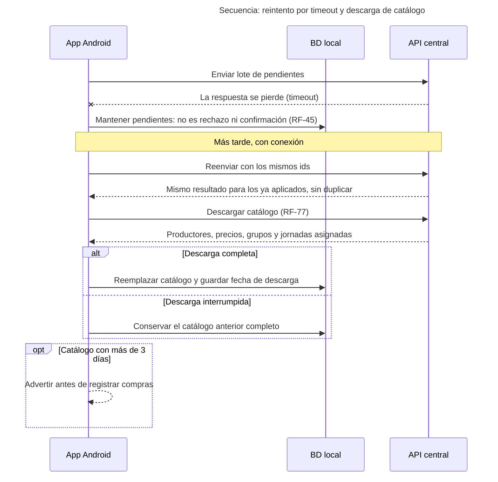
```mermaid
---
title: "Secuencia: reintento por timeout y descarga de catálogo"
---
sequenceDiagram
    participant APP as App Android
    participant BDL as BD local
    participant API as API central

    APP->>API: Enviar lote de pendientes
    API--xAPP: La respuesta se pierde (timeout)
    APP->>BDL: Mantener pendientes: no es rechazo ni confirmación (RF-45)
    Note over APP,API: Más tarde, con conexión
    APP->>API: Reenviar con los mismos ids
    API-->>APP: Mismo resultado para los ya aplicados, sin duplicar

    APP->>API: Descargar catálogo (RF-77)
    API-->>APP: Productores, precios, grupos y jornadas asignadas
    alt Descarga completa
        APP->>BDL: Reemplazar catálogo y guardar fecha de descarga
    else Descarga interrumpida
        APP->>BDL: Conservar el catálogo anterior completo
    end
    opt Catálogo con más de 3 días
        APP-->>APP: Advertir antes de registrar compras
    end
```

## 10a_clases_jornadas_compras

Figura 12 · Clases: jornadas y compras (3.5).

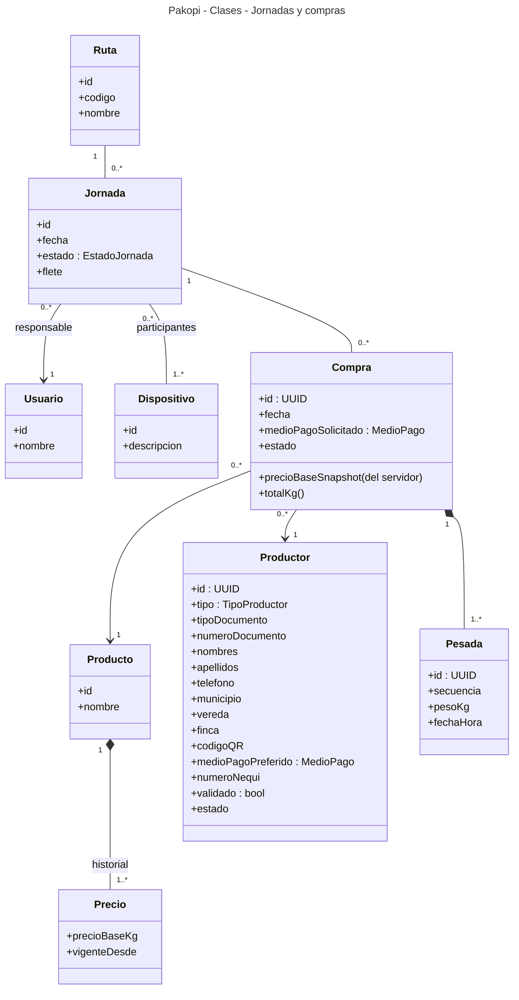
```mermaid
---
title: Pakopi - Clases - Jornadas y compras
---
classDiagram
    direction TB

    class Ruta {
        +id
        +codigo
        +nombre
    }
    class Jornada {
        +id
        +fecha
        +estado : EstadoJornada
        +flete
    }
    class Usuario {
        +id
        +nombre
    }
    class Dispositivo {
        +id
        +descripcion
    }
    class Producto {
        +id
        +nombre
    }
    class Precio {
        +precioBaseKg
        +vigenteDesde
    }
    class Productor {
        +id : UUID
        +tipo : TipoProductor
        +tipoDocumento
        +numeroDocumento
        +nombres
        +apellidos
        +telefono
        +municipio
        +vereda
        +finca
        +codigoQR
        +medioPagoPreferido : MedioPago
        +numeroNequi
        +validado : bool
        +estado
    }
    class Compra {
        +id : UUID
        +fecha
        +precioBaseSnapshot (del servidor)
        +medioPagoSolicitado : MedioPago
        +estado
        +totalKg()
    }
    class Pesada {
        +id : UUID
        +secuencia
        +pesoKg
        +fechaHora
    }

    Ruta "1" -- "0..*" Jornada
    Jornada "0..*" --> "1" Usuario : responsable
    Jornada "0..*" -- "1..*" Dispositivo : participantes
    Jornada "1" -- "0..*" Compra
    Compra "0..*" --> "1" Productor
    Compra "0..*" --> "1" Producto
    Producto "1" *-- "1..*" Precio : historial
    Compra "1" *-- "1..*" Pesada
```

## 10b_clases_liquidacion_pagos

Figura 13 · Clases: liquidación y pagos (3.5).

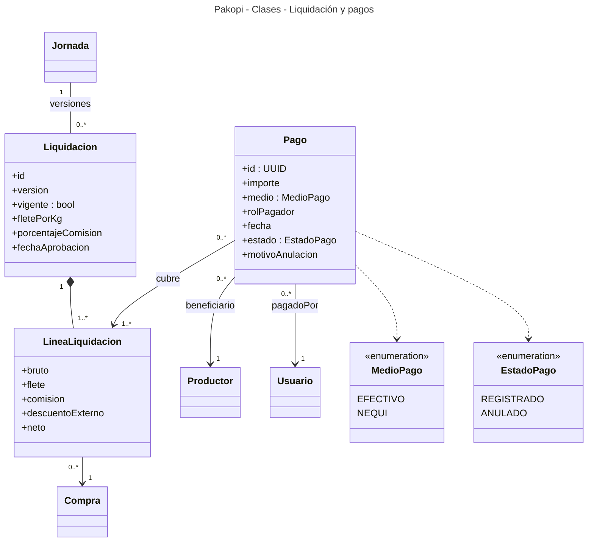
```mermaid
---
title: Pakopi - Clases - Liquidación y pagos
---
classDiagram
    direction TB

    class Jornada
    class Compra
    class Productor
    class Liquidacion {
        +id
        +version
        +vigente : bool
        +fletePorKg
        +porcentajeComision
        +fechaAprobacion
    }
    class LineaLiquidacion {
        +bruto
        +flete
        +comision
        +descuentoExterno
        +neto
    }
    class Usuario
    class Pago {
        +id : UUID
        +importe
        +medio : MedioPago
        +rolPagador
        +fecha
        +estado : EstadoPago
        +motivoAnulacion
    }
    class MedioPago {
        <<enumeration>>
        EFECTIVO
        NEQUI
    }
    class EstadoPago {
        <<enumeration>>
        REGISTRADO
        ANULADO
    }

    Jornada "1" -- "0..*" Liquidacion : versiones
    Liquidacion "1" *-- "1..*" LineaLiquidacion
    LineaLiquidacion "0..*" --> "1" Compra
    Pago "0..*" --> "1..*" LineaLiquidacion : cubre
    Pago "0..*" --> "1" Productor : beneficiario
    Pago "0..*" --> "1" Usuario : pagadoPor
    Pago ..> MedioPago
    Pago ..> EstadoPago
```

## 10c_clases_usuarios_familias

Figura 14 · Clases: usuarios, roles y familias (3.5).

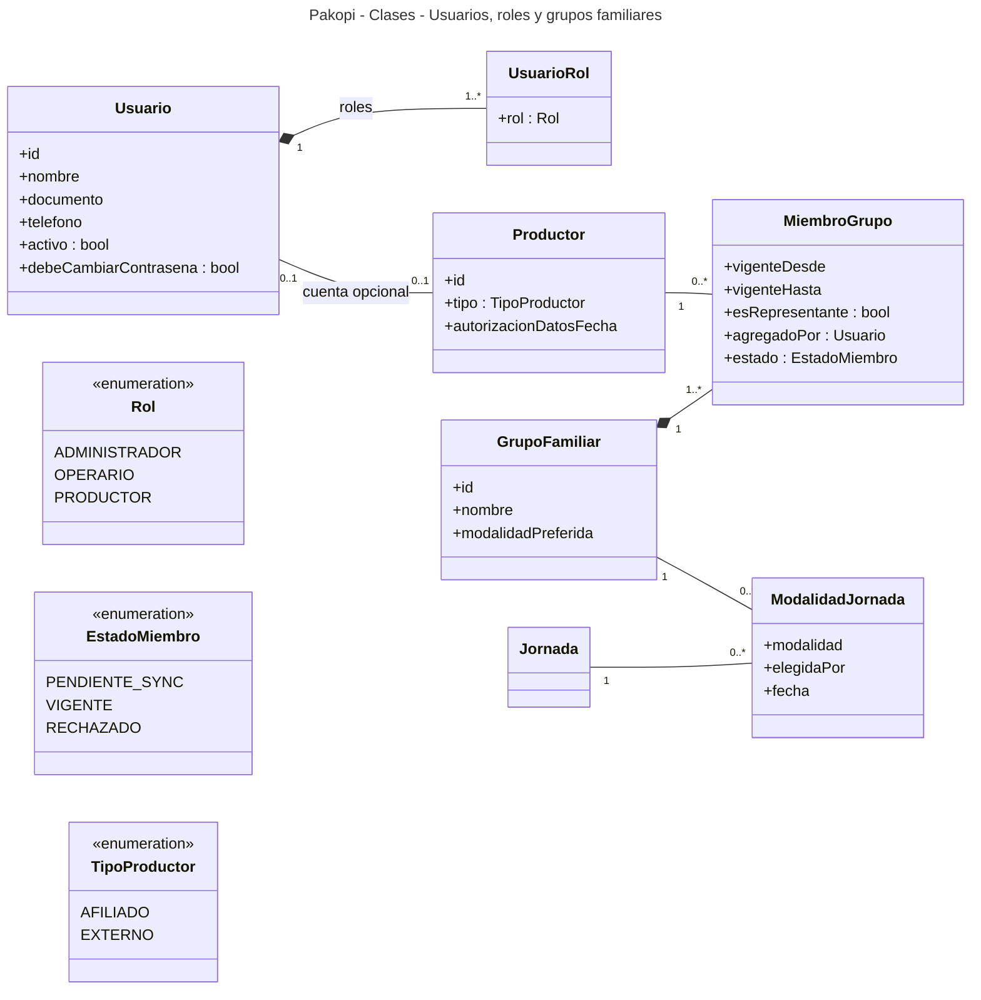
```mermaid
---
title: Pakopi - Clases - Usuarios, roles y grupos familiares
---
classDiagram
    direction LR

    class Usuario {
        +id
        +nombre
        +documento
        +telefono
        +activo : bool
        +debeCambiarContrasena : bool
    }
    class UsuarioRol {
        +rol : Rol
    }
    class Productor {
        +id
        +tipo : TipoProductor
        +autorizacionDatosFecha
    }
    class GrupoFamiliar {
        +id
        +nombre
        +modalidadPreferida
    }
    class MiembroGrupo {
        +vigenteDesde
        +vigenteHasta
        +esRepresentante : bool
        +agregadoPor : Usuario
        +estado : EstadoMiembro
    }
    class ModalidadJornada {
        +modalidad
        +elegidaPor
        +fecha
    }
    class Jornada
    class Rol {
        <<enumeration>>
        ADMINISTRADOR
        OPERARIO
        PRODUCTOR
    }
    class EstadoMiembro {
        <<enumeration>>
        PENDIENTE_SYNC
        VIGENTE
        RECHAZADO
    }
    class TipoProductor {
        <<enumeration>>
        AFILIADO
        EXTERNO
    }

    Usuario "1" *-- "1..*" UsuarioRol : roles
    Usuario "0..1" -- "0..1" Productor : cuenta opcional
    Productor "1" -- "0..*" MiembroGrupo
    GrupoFamiliar "1" *-- "1..*" MiembroGrupo
    GrupoFamiliar "1" -- "0..*" ModalidadJornada
    Jornada "1" -- "0..*" ModalidadJornada
```

## 10d_clases_ventas_sync_auditoria

Figura 15 · Clases: ventas, sincronización y auditoría (3.5).

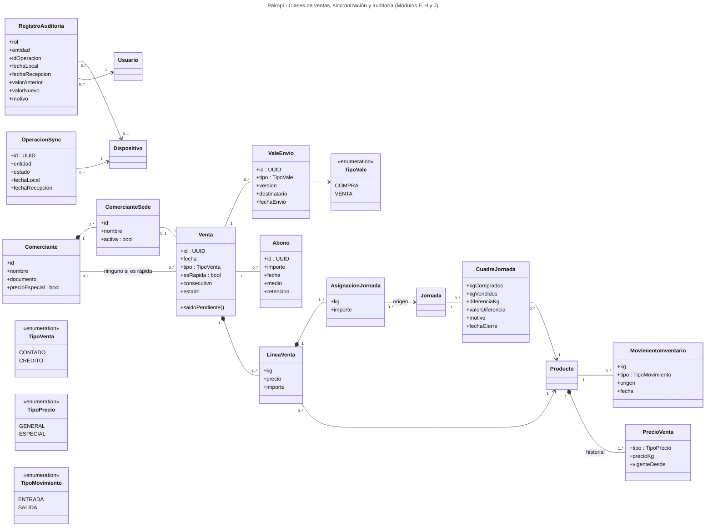
```mermaid
---
title: "Pakopi - Clases de ventas, sincronización y auditoría (Módulos F, H y J)"
---
classDiagram
    direction LR

    class Comerciante {
        +id
        +nombre
        +documento
        +precioEspecial : bool
    }
    class Venta {
        +id : UUID
        +fecha
        +tipo : TipoVenta
        +esRapida : bool
        +consecutivo
        +estado
        +saldoPendiente()
    }
    class LineaVenta {
        +kg
        +precio
        +importe
    }
    class AsignacionJornada {
        +kg
        +importe
    }
    class Abono {
        +id : UUID
        +importe
        +fecha
        +medio
        +retencion
    }
    class ComercianteSede {
        +id
        +nombre
        +activa : bool
    }
    class CuadreJornada {
        +kgComprados
        +kgVendidos
        +diferenciaKg
        +valorDiferencia
        +motivo
        +fechaCierre
    }
    class ValeEnvio {
        +id : UUID
        +tipo : TipoVale
        +version
        +destinatario
        +fechaEnvio
    }
    class Jornada
    class Producto
    class PrecioVenta {
        +tipo : TipoPrecio
        +precioKg
        +vigenteDesde
    }
    class MovimientoInventario {
        +kg
        +tipo : TipoMovimiento
        +origen
        +fecha
    }
    class OperacionSync {
        +id : UUID
        +entidad
        +estado
        +fechaLocal
        +fechaRecepcion
    }
    class Dispositivo
    class Usuario
    class RegistroAuditoria {
        +rol
        +entidad
        +idOperacion
        +fechaLocal
        +fechaRecepcion
        +valorAnterior
        +valorNuevo
        +motivo
    }
    class TipoVenta {
        <<enumeration>>
        CONTADO
        CREDITO
    }
    class TipoPrecio {
        <<enumeration>>
        GENERAL
        ESPECIAL
    }
    class TipoVale {
        <<enumeration>>
        COMPRA
        VENTA
    }
    class TipoMovimiento {
        <<enumeration>>
        ENTRADA
        SALIDA
    }

    Comerciante "0..1" -- "0..*" Venta : ninguno si es rápida
    LineaVenta "0..*" --> "1" Producto
    Producto "1" *-- "1..*" PrecioVenta : historial
    Producto "1" -- "0..*" MovimientoInventario
    Venta "1" *-- "1..*" LineaVenta
    LineaVenta "1" *-- "1..*" AsignacionJornada
    AsignacionJornada "0..*" --> "1" Jornada : origen
    Venta "1" -- "0..*" Abono
    Comerciante "1" *-- "0..*" ComercianteSede
    ComercianteSede "0..1" -- "0..*" Venta
    Jornada "1" -- "0..*" CuadreJornada
    CuadreJornada "0..*" --> "1" Producto
    Venta "1" -- "0..*" ValeEnvio
    ValeEnvio ..> TipoVale
    OperacionSync "0..*" --> "1" Dispositivo
    RegistroAuditoria "0..*" --> "1" Usuario
    RegistroAuditoria "0..*" --> "0..1" Dispositivo
```

## 03_estados_jornada

Figura 16 · Estados de la jornada (5.5).

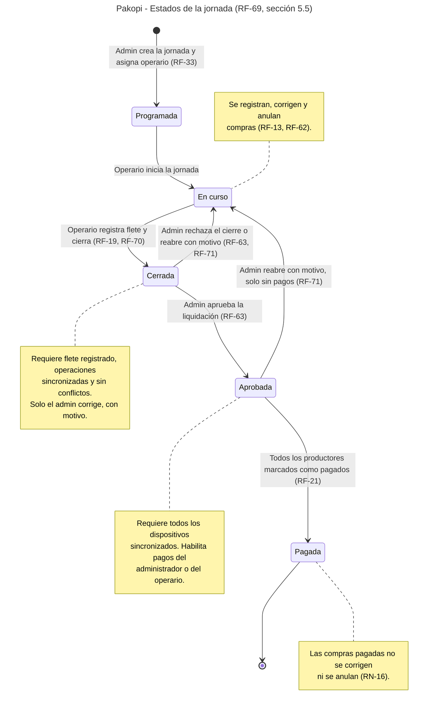
```mermaid
---
title: Pakopi - Estados de la jornada (RF-69, sección 5.5)
---
stateDiagram-v2
    direction TB
    state "Programada" as Programada
    state "En curso" as EnCurso
    state "Cerrada" as Cerrada
    state "Aprobada" as Aprobada
    state "Pagada" as Pagada

    [*] --> Programada : Admin crea la jornada y asigna operario (RF-33)
    Programada --> EnCurso : Operario inicia la jornada
    EnCurso --> Cerrada : Operario registra flete y cierra (RF-19, RF-70)
    Cerrada --> EnCurso : Admin rechaza el cierre o reabre con motivo (RF-63, RF-71)
    Cerrada --> Aprobada : Admin aprueba la liquidación (RF-63)
    Aprobada --> EnCurso : Admin reabre con motivo, solo sin pagos (RF-71)
    Aprobada --> Pagada : Todos los productores marcados como pagados (RF-21)
    Pagada --> [*]

    note left of EnCurso
        Se registran, corrigen y anulan
        compras (RF-13, RF-62).
    end note
    note right of Cerrada
        Requiere flete registrado, operaciones
        sincronizadas y sin conflictos.
        Solo el admin corrige, con motivo.
    end note
    note right of Aprobada
        Requiere todos los dispositivos
        sincronizados. Habilita pagos del
        administrador o del operario.
    end note
    note right of Pagada
        Las compras pagadas no se corrigen
        ni se anulan (RN-16).
    end note
```

## 04_estados_compra_y_pago

Figura 17 · Estados de la compra y del pago (5.5).

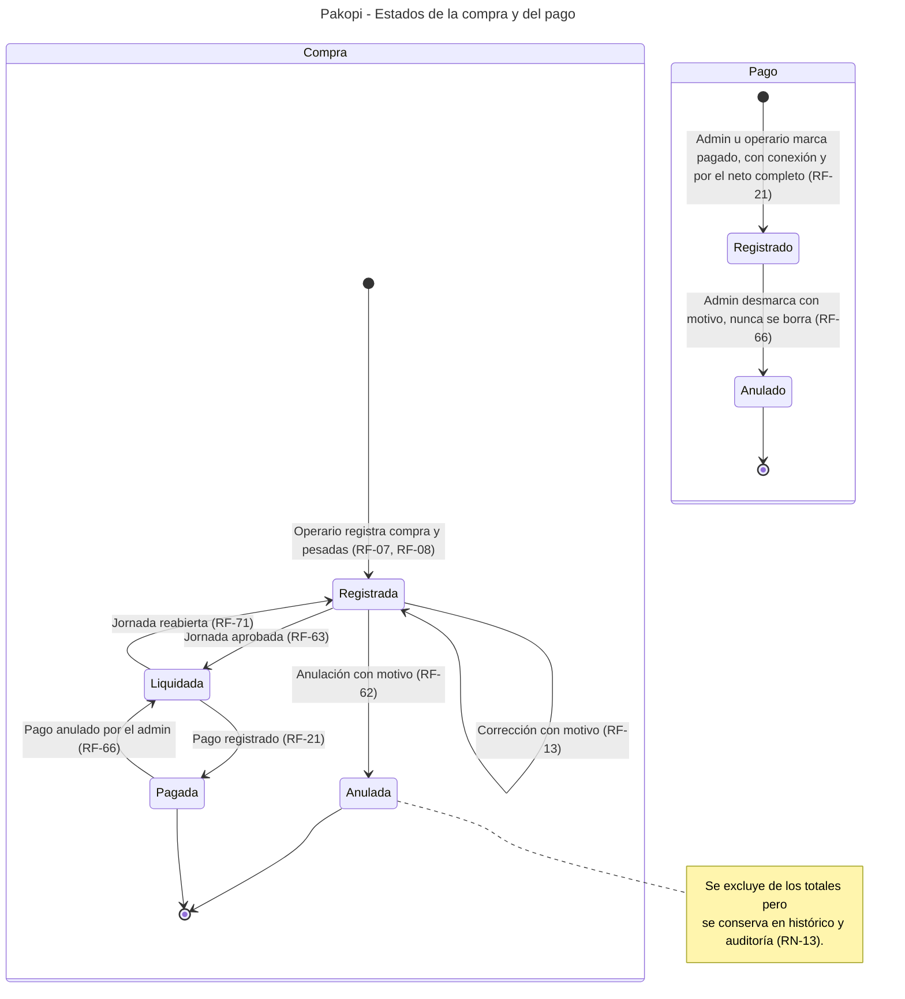
```mermaid
---
title: Pakopi - Estados de la compra y del pago
---
stateDiagram-v2
    direction TB
    state "Compra" as Compra {
        state "Registrada" as CReg
        state "Anulada" as CAnu
        state "Liquidada" as CLiq
        state "Pagada" as CPag

        [*] --> CReg : Operario registra compra y pesadas (RF-07, RF-08)
        CReg --> CReg : Corrección con motivo (RF-13)
        CReg --> CAnu : Anulación con motivo (RF-62)
        CReg --> CLiq : Jornada aprobada (RF-63)
        CLiq --> CReg : Jornada reabierta (RF-71)
        CLiq --> CPag : Pago registrado (RF-21)
        CPag --> CLiq : Pago anulado por el admin (RF-66)
        CAnu --> [*]
        CPag --> [*]
    }

    state "Pago" as Pago {
        state "Registrado" as PReg
        state "Anulado" as PAnu
        [*] --> PReg : Admin u operario marca pagado, con conexión y por el neto completo (RF-21)
        PReg --> PAnu : Admin desmarca con motivo, nunca se borra (RF-66)
        PAnu --> [*]
    }

    note right of CAnu
        Se excluye de los totales pero
        se conserva en histórico y auditoría (RN-13).
    end note
```

## 06a_actividad_ejecucion_jornada

Figura 18 · Actividades de ejecución y cierre (5.5).

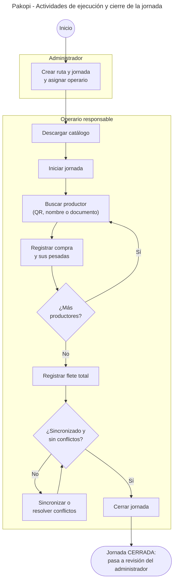
```mermaid
---
title: Pakopi - Actividades de ejecución y cierre de la jornada
---
flowchart TD
    INI((Inicio))

    subgraph ADM["Administrador"]
        A1["Crear ruta y jornada<br/>y asignar operario"]
    end

    subgraph OPE["Operario responsable"]
        O1["Descargar catálogo"]
        O2["Iniciar jornada"]
        O3["Buscar productor<br/>(QR, nombre o documento)"]
        O4["Registrar compra<br/>y sus pesadas"]
        D1{"¿Más<br/>productores?"}
        O5["Registrar flete total"]
        D2{"¿Sincronizado y<br/>sin conflictos?"}
        O6["Sincronizar o<br/>resolver conflictos"]
        O7["Cerrar jornada"]
    end

    FIN(["Jornada CERRADA:<br/>pasa a revisión del administrador"])

    INI --> A1 --> O1 --> O2 --> O3 --> O4 --> D1
    D1 -->|Sí| O3
    D1 -->|No| O5 --> D2
    D2 -->|No| O6 --> D2
    D2 -->|Sí| O7 --> FIN
```

## 06b_actividad_aprobacion_pago

Figura 19 · Actividades de aprobación y pago (5.5).

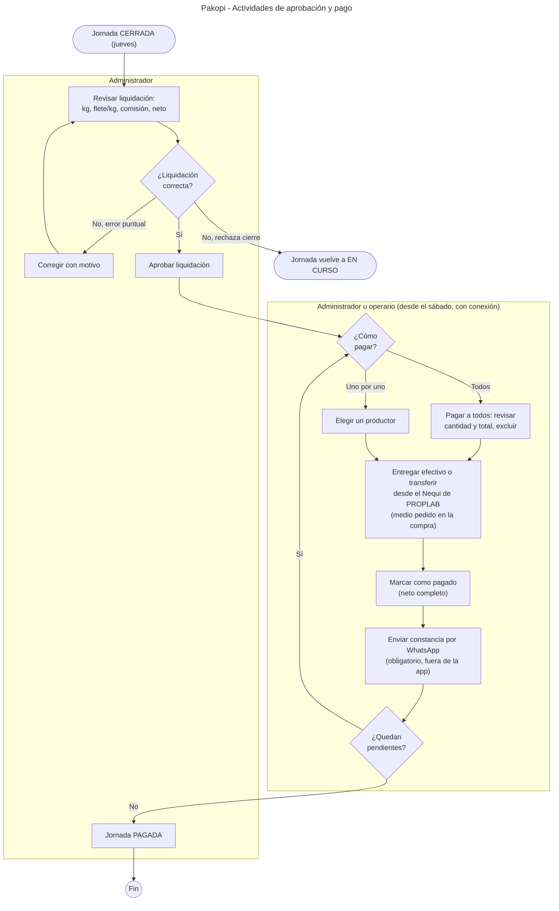
```mermaid
---
title: Pakopi - Actividades de aprobación y pago
---
flowchart TD
    INI(["Jornada CERRADA (jueves)"])
    VUELVE(["Jornada vuelve a EN CURSO"])
    FIN((Fin))

    subgraph ADM["Administrador"]
        A2["Revisar liquidación:<br/>kg, flete/kg, comisión, neto"]
        D3{"¿Liquidación<br/>correcta?"}
        A3["Corregir con motivo"]
        A4["Aprobar liquidación"]
        A8["Jornada PAGADA"]
    end

    subgraph PAG["Administrador u operario (desde el sábado, con conexión)"]
        D7{"¿Cómo<br/>pagar?"}
        T1["Pagar a todos: revisar<br/>cantidad y total, excluir"]
        U1["Elegir un productor"]
        A6["Entregar efectivo o transferir<br/>desde el Nequi de PROPLAB<br/>(medio pedido en la compra)"]
        A7["Marcar como pagado<br/>(neto completo)"]
        A12["Enviar constancia por WhatsApp<br/>(obligatorio, fuera de la app)"]
        D5{"¿Quedan<br/>pendientes?"}
    end

    INI --> A2 --> D3
    D3 -->|"No, error puntual"| A3 --> A2
    D3 -->|"No, rechaza cierre"| VUELVE
    D3 -->|Sí| A4 --> D7
    D7 -->|"Todos"| T1 --> A6
    D7 -->|"Uno por uno"| U1 --> A6
    A6 --> A7 --> A12 --> D5
    D5 -->|Sí| D7
    D5 -->|No| A8 --> FIN
```

## 06_actividad_ciclo_jornada

Vista completa de actividades (no está en el Word; desactualizada en pagos, ver figuras 18 y 19).

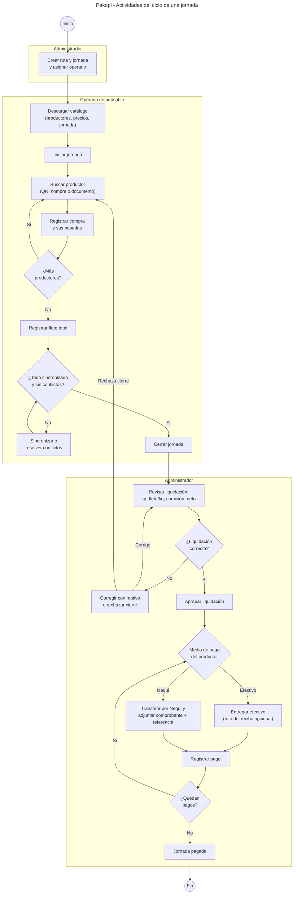
```mermaid
---
title: Pakopi - Actividades del ciclo de una jornada
---
flowchart TD
    INI((Inicio))
    FIN((Fin))

    subgraph ADM1["Administrador"]
        A1["Crear ruta y jornada<br/>y asignar operario"]
    end

    subgraph OPE["Operario responsable"]
        O1["Descargar catálogo<br/>(productores, precios, jornada)"]
        O2["Iniciar jornada"]
        O3["Buscar productor<br/>(QR, nombre o documento)"]
        O4["Registrar compra<br/>y sus pesadas"]
        D1{"¿Más<br/>productores?"}
        O5["Registrar flete total"]
        D2{"¿Todo sincronizado<br/>y sin conflictos?"}
        O6["Sincronizar o<br/>resolver conflictos"]
        O7["Cerrar jornada"]
    end

    subgraph ADM2["Administrador"]
        A2["Revisar liquidación:<br/>kg, flete/kg, comisión, neto"]
        D3{"¿Liquidación<br/>correcta?"}
        A3["Corregir con motivo<br/>o rechazar cierre"]
        A4["Aprobar liquidación"]
        D4{"Medio de pago<br/>del productor"}
        A5["Entregar efectivo<br/>(foto del recibo opcional)"]
        A6["Transferir por Nequi y<br/>adjuntar comprobante + referencia"]
        A7["Registrar pago"]
        D5{"¿Quedan<br/>pagos?"}
        A8["Jornada pagada"]
    end

    INI --> A1 --> O1 --> O2 --> O3 --> O4 --> D1
    D1 -->|Sí| O3
    D1 -->|No| O5 --> D2
    D2 -->|No| O6 --> D2
    D2 -->|Sí| O7 --> A2 --> D3
    D3 -->|No| A3
    A3 -->|"Corrige"| A2
    A3 -->|"Rechaza cierre"| O3
    D3 -->|Sí| A4 --> D4
    D4 -->|Efectivo| A5 --> A7
    D4 -->|Nequi| A6 --> A7
    A7 --> D5
    D5 -->|Sí| D4
    D5 -->|No| A8 --> FIN
```

## 10_clases_modelo_datos

Vista completa del modelo de clases (no está en el Word, se dividió en las figuras 12 a 15).

```mermaid
---
title: Pakopi - Diagrama de clases (modelo de datos)
---
classDiagram
    direction LR

    class Usuario {
        +id
        +nombre
        +documento
        +telefono
        +activo : bool
        +debeCambiarContrasena : bool
    }
    class UsuarioRol {
        +rol : Rol
    }
    class Productor {
        +id : UUID
        +tipo : TipoProductor
        +tipoDocumento
        +numeroDocumento
        +nombres
        +apellidos
        +telefono
        +municipio
        +vereda
        +finca
        +codigoQR
        +medioPagoPreferido : MedioPago
        +numeroNequi
        +validado : bool
        +autorizacionDatosFecha
        +estado
    }
    class GrupoFamiliar {
        +id
        +nombre
        +modalidadPreferida : Modalidad
    }
    class MiembroGrupo {
        +vigenteDesde
        +vigenteHasta
        +esRepresentante : bool
    }
    class ModalidadJornada {
        +modalidad : Modalidad
        +elegidaPor
        +fecha
    }
    class Producto {
        +id
        +nombre
    }
    class Precio {
        +precioBaseKg
        +vigenteDesde
    }
    class Ruta {
        +id
        +codigo
        +nombre
    }
    class Jornada {
        +id
        +fecha
        +estado : EstadoJornada
        +flete
    }
    class Dispositivo {
        +id
        +descripcion
    }
    class Compra {
        +id : UUID
        +fecha
        +precioBaseSnapshot
        +medioPagoSolicitado : MedioPago
        +estado : EstadoCompra
        +totalKg()
    }
    class Pesada {
        +id : UUID
        +secuencia
        +pesoKg
        +fechaHora
    }
    class Liquidacion {
        +id
        +version
        +vigente : bool
        +fletePorKg
        +porcentajeComision
        +fechaAprobacion
    }
    class LineaLiquidacion {
        +bruto
        +flete
        +comision
        +descuentoExterno
        +neto
    }
    class Pago {
        +id : UUID
        +importe
        +medio : MedioPago
        +rolPagador
        +fecha
        +estado
        +motivoAnulacion
    }
    class Comerciante {
        +id
        +nombre
        +documento
    }
    class Venta {
        +id : UUID
        +fecha
        +tipo : TipoVenta
        +estado
        +saldoPendiente()
    }
    class LineaVenta {
        +kg
        +precio
        +importe
    }
    class AsignacionJornada {
        +kg
        +importe
    }
    class Abono {
        +id : UUID
        +importe
        +fecha
        +medio : MedioPago
    }
    class OperacionSync {
        +id : UUID
        +entidad
        +estado : EstadoSync
        +fechaLocal
        +fechaRecepcion
    }
    class RegistroAuditoria {
        +id
        +rol
        +entidad
        +idOperacion
        +fechaLocal
        +fechaRecepcion
        +valorAnterior
        +valorNuevo
        +motivo
    }

    class Rol {
        <<enumeration>>
        ADMINISTRADOR
        OPERARIO
        PRODUCTOR
    }
    class TipoProductor {
        <<enumeration>>
        AFILIADO
        EXTERNO
    }
    class EstadoJornada {
        <<enumeration>>
        PROGRAMADA
        EN_CURSO
        CERRADA
        APROBADA
        PAGADA
    }
    class MedioPago {
        <<enumeration>>
        EFECTIVO
        NEQUI
    }
    class TipoVenta {
        <<enumeration>>
        CONTADO
        CREDITO
    }

    Usuario "1" *-- "1..*" UsuarioRol : roles
    Usuario "0..1" -- "0..1" Productor : cuenta opcional
    Productor "1" -- "0..*" MiembroGrupo
    GrupoFamiliar "1" *-- "1..*" MiembroGrupo
    GrupoFamiliar "1" -- "0..*" ModalidadJornada
    Jornada "1" -- "0..*" ModalidadJornada
    Producto "1" *-- "1..*" Precio : historial
    Ruta "1" -- "0..*" Jornada
    Jornada "0..*" --> "1" Usuario : responsable
    Jornada "0..*" -- "1..*" Dispositivo : participantes
    Jornada "1" -- "0..*" Compra
    Compra "0..*" --> "1" Productor
    Compra "0..*" --> "1" Producto
    Compra "1" *-- "1..*" Pesada
    Jornada "1" -- "0..*" Liquidacion : versiones
    Liquidacion "1" *-- "1..*" LineaLiquidacion
    LineaLiquidacion "0..*" --> "1" Compra
    Pago "0..*" --> "1..*" LineaLiquidacion : cubre
    Pago "0..*" --> "1" Productor : beneficiario
    Pago "0..*" --> "1" Usuario : pagadoPor
    Comerciante "1" -- "0..*" Venta
    Venta "1" *-- "1..*" LineaVenta
    LineaVenta "1" *-- "1..*" AsignacionJornada
    AsignacionJornada "0..*" --> "1" Jornada : origen
    Venta "1" -- "0..*" Abono
    OperacionSync "0..*" --> "1" Dispositivo
    RegistroAuditoria "0..*" --> "1" Usuario
    RegistroAuditoria "0..*" --> "0..1" Dispositivo
```
